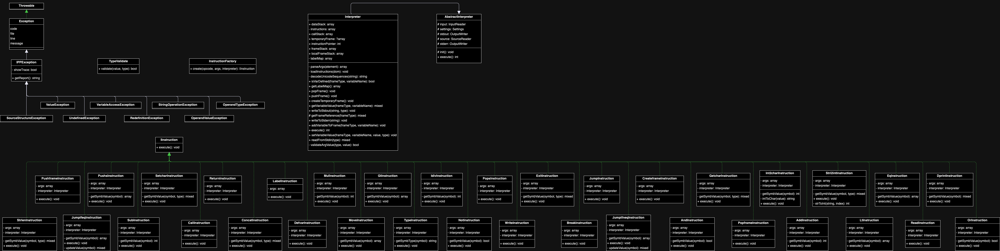

# Implementační dokumentace k 2. úloze do IPP 2023/2024
**Jméno a příjmení: Tomáš Barták**

**Login: xbarta51**

# Úvod
Úkolem bylo vytvořit interpret XML reprezentace kódu v jazyce PHP s využitím objektově orientovaného programování. K tvorbě tohoto programu bylo zapotřebí využití poskytnutého rámce ipp-core, který byl využíván pro čtení XML reprezentace ze standardního vstupu, čtení vstupního souboru pro funkci **READ**, výpis na standardní či chybový výstup a nebo také výpis chybových hlášek s příslušným návratovým kódem.

# Návrhové vzory
Pro implementaci bylo využito *rozhraní* **IInstruction**, které zajišťuje, že třídy, reprezentující instrukce musí implementovat metodu *execute()*. Zároveň byl využit návrhový vzor *tovární metoda* **InstructionFactory**, která slouží k vytvoření instancí tříd pro konkrétní instrukce, které jsou následně uloženy do pole *$instructions* pro pozdější zpracování.

# Implementace
Program je tvořen velkým počtem tříd, pro jednodušší orientaci jsou rozdělené do 3 kategorií, *Instructions*, kde jsou obsaženy všechny třídy instrukcí společně s rozhraním instrukcí *IInstruction* a tovární metodou *InstructionFactory*. 

Další kategorií jsou třídy pro vlastní výjimky *CustomExceptions*, kde každá třída reprezentuje jinou výjimku. Tyto výjimky rozšiřují *IPPException* z rámce IPP-core a jsou používány při nalezení chyby u vstupního XML souboru, chybného typu operandu, jeho hodnoty, při přístupu k neexistujícímu rámci, proměnné atd.

Poslední kategorií jsou třídy uvnitř *Utilities* a samotný *Interpreter*, které obsahují pomocné třídy a metody pro chod programu.

## Hlavní část programu
Hlavní část programu je uvnitř třídy *Interpreter*, tato část programu má za úkol z XML souboru načíst instrukce, k čemuž využívá metody *LoadInstructions*, která vytváří instance pro jednotlivé instrukce včetně jejich argumentů a zároveň si udržuje přehled o pozici načtených **LABEL** instrukcí. Ty jsou ukládány do proměnné *$labelMap*, ve které je uloženo jak jméno daného návěští, tak jeho pozice v poli instrukcí pro jednoduché instrukce pro skoky či volání funkcí.

Po načtení instrukcí je program řízen pomocí proměnné *$instructionPointer*, která udává pozici momentálně zpracovávané instrukce. Je využit v cyklu hlavního programu ke zpracovávání konkrétních instrukcí až do doby, než dojde na konec XML reprezentace kódu. V tomto cyklu je *$instructionPointer* zvyšován sekvenčně, ale může být jeho hodnota upravena také např. pomocí instrukcí *CALL*, *RETURN*, *JUMP*, či jiné jeho variace.

## Výjimky
Pro implementaci interpretu bylo nutné vytvořit vlastní výjimky, které rozšiřují výjimku IPPException z dostupného rámce IPP-core. Pro danou výjimku je vždy specifikován její návratový kód z rámce IPP-core v souboru *ReturnCode.php*.

## Instrukce
Každá načtená instrukce je uložená jako instance v poli instrukcí společně se všemi svými argumenty. Všechny instrukce obsahují metodu *__construct*, která kromě inicializace zajišťuje také prvotní kontrolu argumentů. Kontroluje například zda-li typy argumentů v XML reprezentaci odpovídají datovým typům, které daná instrukce má akceptovat. Dále taky obsahují metodu *execute()*, která již obsahuje logiku dané instrukce. Většina instrukcí ke svému fungování využívá pomocných metod ze třídy *Interpreter*, ať už se jedná například o *isVarDefined*, *getVariableValue*, *setVariableValue*, *addVariableToFrame*, která se stará o přidání proměnné do typu rámce podle typu rámce stanoveného XML reprezentací či mnoho dalších.

### Náročnější instrukce
Mezi náročnějšími instrukcemi na implementaci byly ty, které vyžadují změnu **toku programu**, jako například instrukce *CALL*, *RETURN* či případně variace *JUMP* instrukcí. K práci s těmito instrukcemi bylo kromě nutnosti uchovávat si pozice návěští potřeba také zajistit změnu chodu programu pomocí *$instructionPointeru*, který bylo potřeba nastavit na pozici daného návěští. Pro instrukce *CALL* a *RETURN* bylo navíc potřeba vytvořit tzv. *zásobník volání*, do kterého se při každém volání funkce uložil aktuální stav proměnné *$instructionPointer* a až následně mohl být změněn na návěští dané funkce. Naopak při instrukci *RETURN* se z tohoto zásobníku musela původní hodnota vybrat, aby byl zajištěn správný chod programu a nedocházelo k nekonečným cyklům.

## Diagram tříd

